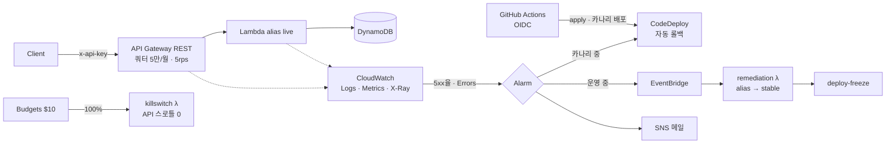

# AWS Serverless Self-Healing & Observability

장애를 **스스로 감지하고 되돌리는** 서버리스 API. 관측성(로그·메트릭·트레이스), 2단 자동 롤백, OIDC 기반 CI/CD, 그리고 **"예산을 넘지 않는 구조"**를 Terraform으로 구현한 클라우드 엔지니어링 포트폴리오입니다.

[](https://github.com/dodongwon33/aws-serverless-selfhealing/actions/workflows/deploy.yml)



## 핵심 포인트

| | |
|---|---|
| **2단 자동 롤백** | 배포 시점엔 CodeDeploy 카나리(10% → 5분 → 100%), 배포 이후엔 알람 → EventBridge → 직접 구현한 remediation이 alias를 마지막 정상 버전으로. 롤백 후 배포 동결로 재배포 사고 방지 |
| **증명 가능한 복구** | `scripts/chaos_bad_release.sh` — 장애 버전을 live에 올리고 4~6분 뒤 자동 복구되는 과정을 관찰 |
| **관측성 3요소** | Powertools 구조화 로그(요청 ID 상관), 기본 메트릭 대시보드, API GW→Lambda→DynamoDB X-Ray 트레이스, Logs Insights 저장 쿼리 |
| **비용 상한 설계** | 최악 월 ≈ $0.6. 쿼터(요청 수 상한) + Budgets 알림 + 예산 초과 시 킬스위치. 유료 커스텀 메트릭 0개 |
| **보안** | 장기 키 0개(OIDC), PR/배포 역할 분리, **권한 경계로 IaC 역할의 권한 상승 차단** |
| **설계 검토** | 초안 설계의 결함 31건을 찾아 수정 → [docs/REVIEW.md](docs/REVIEW.md) |

## 문서
- [docs/DESIGN.md](docs/DESIGN.md) — 아키텍처 · 컴포넌트 · 비용 산정 · 보안
- [docs/REVIEW.md](docs/REVIEW.md) — 초안 대비 결함과 수정 근거, 검증 결과

## 구조
```
bootstrap/            state 버킷 · GitHub OIDC · deploy/plan 역할 · 권한 경계 (1회, 로컬 state)
infra/environments/   dev 환경 (S3 backend + 네이티브 락)
infra/modules/        lambda_app · lambda_function · dynamodb · api · notification · monitoring · deploy · remediation · guardrails
src/                  app(API) · remediation(자동복구) · killswitch(예산)
tests/                pytest + moto
scripts/              load.py(저율 부하) · chaos_bad_release.sh(장애 시연)
.github/workflows/    ci.yml(PR) · deploy.yml(main)
```

## 런북

### 0. 로컬 검증 (AWS 비용 0)
```bash
python3 -m venv .venv && .venv/bin/pip install -r requirements-dev.txt
.venv/bin/ruff check . && .venv/bin/pytest
terraform fmt -check -recursive
```

### 1. Bootstrap (1회, 약 5분)
```bash
cd bootstrap
cp terraform.tfvars.example terraform.tfvars   # 기존 OIDC Provider 있으면 create_oidc_provider=false
terraform init && terraform apply
terraform output                                # 아래 2단계에 사용
```

### 2. GitHub 연결 (약 3분)
```bash
gh variable set AWS_DEPLOY_ROLE_ARN --body "$(terraform -chdir=bootstrap output -raw deploy_role_arn)"
gh variable set AWS_PLAN_ROLE_ARN   --body "$(terraform -chdir=bootstrap output -raw plan_role_arn)"
gh variable set TF_STATE_BUCKET     --body "$(terraform -chdir=bootstrap output -raw state_bucket)"
gh secret   set ALERT_EMAIL         # 프롬프트에 메일 주소 입력
```

### 3. 배포 (약 10분)
main에 push하거나 Actions → deploy → Run workflow. 첫 실행 후 받은 **SNS 구독 확인 메일의 Confirm**을 눌러야 알림이 옵니다.

### 4. 자가복구 시연 (약 10분, 요청 ~1,800건 ≈ $0.01)
```bash
cd infra/environments/dev && terraform init -backend-config="bucket=<state_bucket>" && cd -
./scripts/chaos_bad_release.sh 0.5
```
`200` 사이에 `502`가 섞이다가 수 분 뒤 `live=v<stable>`로 바뀌고 메일이 옵니다. 이후 Actions → deploy → `unfreeze=true`로 동결 해제.

### 5. 정리
```bash
terraform -chdir=infra/environments/dev destroy
terraform -chdir=bootstrap destroy   # state 버킷을 비운 뒤
```

## 기술 스택
AWS (API Gateway · Lambda · DynamoDB · CloudWatch · X-Ray · EventBridge · SNS · CodeDeploy · SSM · Budgets · IAM OIDC) · Terraform 1.10+ · Python 3.12 · Powertools for AWS Lambda · GitHub Actions · pytest/moto
